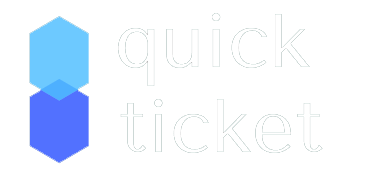

<<<<<<< HEAD
# 
> Sistema empresarial para auxiliar usuarios em troca de tarefas.

=======
# 
> Sistema empresarial para auxiliar usuarios em troca de tarefas.

## O Projeto
   * Quick Ticket auxilia o ligamento entre setores de empresas de médio/grande porte. Através do sistema, funcionarios e diretores         ficam a par de todo o andamento de solicitações realizados entre setores.

>>>>>>> 32beda9ef9f3be973a2cd08615dbeb25b3ebb87c
## Linguagens

* PHP
* SQL
* JavScript (AJAX)

## Bibliotecas

* Materialize
* Material Design
* Jquery

## Auxilios

<<<<<<< HEAD
### Progressive Web APP - PWA

   * Progressivo - Funciona para qualquer usuário, independentemente do navegador escolhido, pois é criado com aprimoramento progressivo como princípio fundamental.
   * Responsivo - Se adequa a qualquer formato: desktop, celular, tablet ou o que for inventado a seguir.
   * Independente de conectividade - Aprimorado com service workers para trabalhar off-line ou em redes de baixa qualidade.
   * Semelhante a aplicativos - Parece com aplicativos para os usuários, com interações e navegação de estilo de aplicativos, pois é compilado no modelo de shell de aplicativo.
   * Atual - Sempre atualizado graças ao processo de atualização do service worker.
   * Seguro - Fornecido via HTTPS para evitar invasões e garantir que o conteúdo não seja adulterado.
   * Descobrível - Pode ser identificado como "aplicativo" graças aos manifestos W3C e ao escopo de registro do service worker, que permitem que os mecanismos de pesquisa os encontrem.
   * Reenvolvente - Facilita o reengajamento com recursos como notificações push.
   * Instalável - Permite que os usuários "guardem" os aplicativos mais úteis em suas telas iniciais sem precisar acessar uma loja de aplicativos.
   * Linkável - Compartilhe facilmente por URL, não requer instalação complexa. 

    [Confira na página oficial do Google](https://developers.google.com/web/fundamentals/codelabs/your-first-pwapp/?hl=pt-br)
=======
#### Progressive Web APP - PWA

   * Progressivo - Funciona para qualquer usuário, independentemente do navegador escolhido, pois é criado com aprimoramento progressivo como princípio fundamental.
   * Responsivo - Se adequa a qualquer formato: desktop, celular, tablet ou o que for inventado a seguir.
   * Independente de conectividade - Aprimorado com service workers para trabalhar off-line ou em redes de baixa qualidade.
   * Semelhante a aplicativos - Parece com aplicativos para os usuários, com interações e navegação de estilo de aplicativos, pois é compilado no modelo de shell de aplicativo.
   * Atual - Sempre atualizado graças ao processo de atualização do service worker.
   * Seguro - Fornecido via HTTPS para evitar invasões e garantir que o conteúdo não seja adulterado.
   * Descobrível - Pode ser identificado como "aplicativo" graças aos manifestos W3C e ao escopo de registro do service worker, que permitem que os mecanismos de pesquisa os encontrem.
   * Reenvolvente - Facilita o reengajamento com recursos como notificações push.
   * Instalável - Permite que os usuários "guardem" os aplicativos mais úteis em suas telas iniciais sem precisar acessar uma loja de aplicativos.
   * Linkável - Compartilhe facilmente por URL, não requer instalação complexa. 
     
     [Confira na página oficial do Google](https://developers.google.com/web/fundamentals/codelabs/your-first-pwapp/?hl=pt-br)
    
>>>>>>> 32beda9ef9f3be973a2cd08615dbeb25b3ebb87c

## Histórico de lançamentos

* 27 de Setembro
    * Pagina Inicial com Login
* 25 de Outubro
    * Pagina Inicial e Pagina de novo Ticket (layout)
* 22 de Novembro
    * Envio e Recebimento de Tickets

## Integrantes

* Lucas Bruno Ferreira

## Portifólio

<<<<<<< HEAD
[Imgur](https://i.imgur.com/E2rknp2.png)
>Tela de Login

[Imgur](https://i.imgur.com/iso1LCo.png)
>tela de cadastro

[Imgur](https://i.imgur.com/SFElLXC.png)
>tela de Tickets urgentes
=======
* [Tela de Inicio](https://imgur.com/E2rknp2)

* [Tela de Cadastro](https://i.imgur.com/iso1LCo.png)

* [Tela de Tickets](https://i.imgur.com/SFElLXC.png)

>>>>>>> 32beda9ef9f3be973a2cd08615dbeb25b3ebb87c

